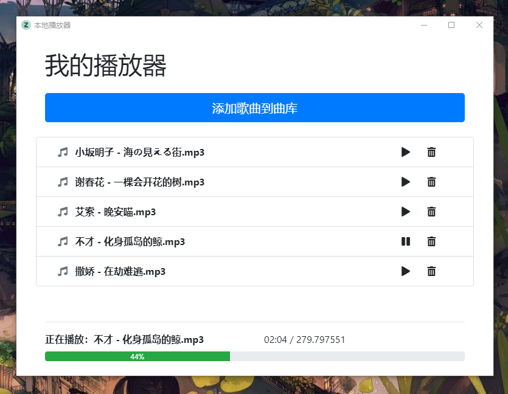
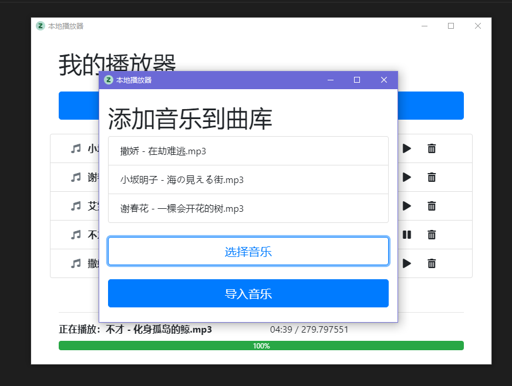

# my-music

**本项目使用 Electron 完成了一个简单的本地音乐播放器**

不多说，上图：

<span></span>
<span></span>

使用本项目

第一步安装依赖

```bash
npm install
或
yarn
```
这里建议使用yarn安装，因为需要下载electron浏览器内核，有54m+，蛮大的，如果用npm安装会非常慢

本地运行项目

```bash
npm start
```

项目打包成 App

```bash
npm run dist
```

打包我自己配置了好久，要哭了.....这个是我比着教程的抄的，三大系统都能打包


